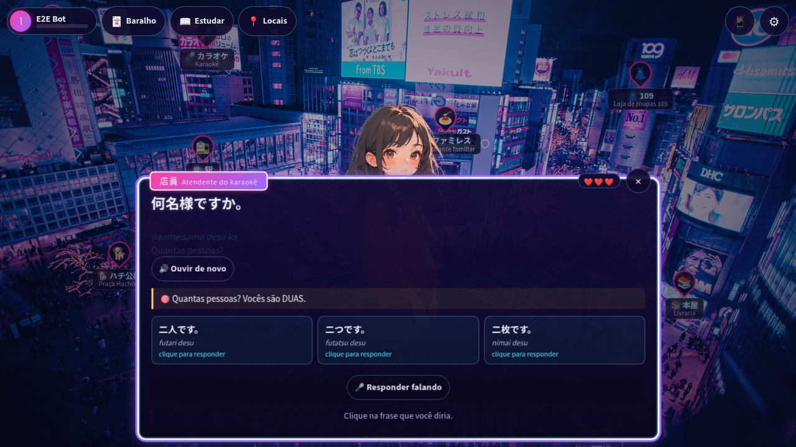
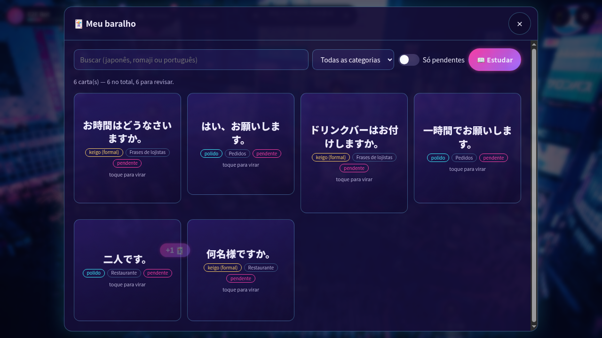

# 🏮 Nihongo City

**Aprenda japonês do dia a dia vivendo Shibuya.** Um RPG de navegador para quem fala português: você anda pela cidade, conversa com NPCs em japonês — respondendo **com a sua voz** — e cada frase que aparece vira uma carta num baralho de repetição espaçada.

Feito para rodar na TV da sala (testado em TVs LG webOS), com o **celular como microfone**: escaneie um QR code e fale no telefone; a resposta aparece na TV.



## ✨ O que tem no jogo

- **Cidade explorável** — fotos de Shibuya com locais clicáveis (konbini, estação, izakaya, santuário, sentō…) e navegação por setas para controle remoto.
- **Conversas com NPCs** — 39 cenários com ramificações: pedir na lanchonete, pagar a conta, perguntar a plataforma, recarregar o Suica, fazer uma oração no templo.
- **Responda falando** — reconhecimento de voz em japonês (Web Speech API) com comparação tolerante: aceita kanji, kana, variantes e conversa a leitura no servidor com [kuromoji](https://github.com/takuyaa/kuromoji.js). Sem microfone, é só clicar na resposta.
- **Celular como microfone** — pareamento por QR code, HTTPS local com certificado autoassinado e comunicação TV ↔ celular via Server-Sent Events.
- **Cultura, não só língua** — cada evento termina com uma dica cultural (etiqueta no trem, como pagar, regras do sentō…), e as frases trazem nível de formalidade (casual / polido / keigo) e notas de uso.
- **Baralho com repetição espaçada (SM-2)** — três modos de estudo: ouvir e repetir, ler e traduzir, escrever em kana com teclado na tela.
- **Estudar com TV** — trechos de ~5 min de vídeos do YouTube para ouvir (rádio) ou assistir (TV), com legenda em japonês ou PT-BR e o texto do trecho para ler e imprimir.
- **Convites espontâneos** — se você fica parado, um NPC aparece chamando para um evento.
- **313 expressões com áudio** e progresso salvo por nome (sem cadastro).



## 🚀 Começando

**Requisitos:** Node.js 20+ (desenvolvido no 23) e npm. Python 3 só se você for gerar áudios novos.

```bash
git clone <url-do-repositorio>
cd game-nihongo
npm install
npm run seed     # cria o banco SQLite a partir de server/seed/*.json
npm run dev      # http://localhost:3000
```

Abra `http://localhost:3000`, digite seu nome e comece. Para usar o **celular como microfone**, clique em 📱 no jogo, conecte o celular no mesmo Wi-Fi e escaneie o QR code. Na primeira vez o navegador vai avisar sobre o certificado ("Sua conexão não é particular") — toque em **Avançado → Continuar**; é o certificado local gerado pelo próprio jogo.

> O reconhecimento de voz depende do navegador: funciona no Chrome (desktop e Android). Em navegadores sem suporte, o jogo oferece respostas por clique ou por teclado.

### Scripts

| Comando | O que faz |
|---|---|
| `npm run dev` | Servidor em modo desenvolvimento; reinicia ao salvar o servidor e recompila o frontend |
| `npm start` | Compila o servidor (`tsc` → `dist/`) e roda |
| `npm run build` | Compila servidor e frontend |
| `npm run seed` | Valida e grava o conteúdo de `server/seed/*.json` no SQLite |
| `npm run typecheck` | Checa os tipos do servidor e do cliente |

### Variáveis de ambiente

Podem ser definidas no ambiente ou em um arquivo `.env` na raiz do projeto (o ambiente tem prioridade).

| Variável | Padrão | Uso |
|---|---|---|
| `PORT` | `3000` | Porta HTTP |
| `HTTPS_PORT` | `3443` | Porta HTTPS (necessária para o microfone do celular) |
| `PUBLIC_HOST` | IP da rede local | Host usado no QR code de pareamento |
| `PUBLIC_URL` | — | URL externa completa para o celular (ex.: túnel da Cloudflare, `https://nihongo.exemplo.com`); substitui host e porta no QR code |
| `NIHONGO_DB` | `server/db/nihongo.db` | Caminho do banco SQLite |
| `NODE_ENV` | — | `production` desliga a recompilação automática do frontend |

## 🏗️ Arquitetura

TypeScript de ponta a ponta, organizado em **DDD + arquitetura hexagonal (ports & adapters)**, sem framework no frontend.

```
shared/contracts.ts      Contrato HTTP/SSE compartilhado por servidor e cliente
server/src/
  domain/                Regras puras: jogador, baralho (SM-2), eventos, conteúdo, sessão remota
  application/           Casos de uso (um por classe) e portas de saída
  infrastructure/        Adaptadores: SQLite, Express, SSE, kuromoji, QR code, TLS, esbuild
  container.ts           Composition root — único lugar que conhece as classes concretas
server/seed/*.json       Conteúdo do jogo (fonte da verdade)
client/
  domain/                Comparação de respostas, kana, datas de revisão
  application/           Estado, portas e serviços (matcher de fala, configurações)
  infrastructure/        HTTP, Web Audio, Web Speech, SSE, localStorage
  ui/                    Telas (cidade, diálogo, estudo, baralho…)
  app/main.ts            Entrada da TV · phone/main.ts: entrada do celular
```

- **Servidor:** Node.js + Express 5, SQLite via `better-sqlite3`.
- **Frontend:** compilado pelo esbuild para **Chrome 79**, o navegador das TVs LG webOS 6 — evite APIs mais novas que isso (o `client/tsconfig.json` usa `lib: ES2019` para ajudar).
- A regra de dependência é: `domain` não importa nada de fora; `application` depende só do domínio; infraestrutura e UI implementam ou consomem as portas.

## 📝 Adicionando conteúdo

Todo o conteúdo fica em `server/seed/`:

| Arquivo | Conteúdo |
|---|---|
| `expressions.json` | Frases: japonês, kana, romaji, tradução, uso, formalidade, categoria e áudio |
| `npcs.json` | Personagens (imagem em `img/npcs/<id>.png`, proporção 9:16) |
| `scenes.json` / `locations.json` | Cenas (fotos) e os pontos clicáveis sobre elas, em % da imagem |
| `scenarios.json` | Conversas: passos, opções de resposta, feedback e ramificações (`next`) |

Depois de editar, rode `npm run seed` — ele valida as referências cruzadas (NPC, local, falas, passos) e aponta o que estiver quebrado.

Para posicionar locais numa cena, abra o jogo com `?edit=1`: arraste sobre a foto e copie as coordenadas para `locations.json`.

### Gerando áudios

As falas são geradas com [gTTS](https://github.com/pndurette/gTTS):

```bash
cd scripts
python -m venv .venv && source .venv/bin/activate
pip install -r requirements.txt
python generate_audio.py            # só as expressões sem áudio
python generate_audio.py --force    # regenera tudo
python generate_audio.py --slow     # também gera versões lentas
cd .. && npm run seed
```

Os arquivos ficam em `audios/voices/<sha1>.mp3` e o campo `audio_file` de `expressions.json` é atualizado automaticamente.

### Adicionando vídeos ao "Estudar com TV"

Precisa do [ffmpeg](https://ffmpeg.org/) instalado (`sudo apt install ffmpeg`) e do banco já criado (`npm run seed`).

```bash
cd scripts && source .venv/bin/activate
pip install -r requirements.txt
python add_video.py "https://www.youtube.com/watch?v=..."   # baixa, corta e registra
python add_video.py "<url>" --force                         # refaz um vídeo já adicionado
python add_video.py --resub <id>                             # baixa de novo só as legendas (não recorta o vídeo)
python add_video.py --reindex                               # recria o banco a partir dos arquivos
python add_video.py --remove <id-do-video>                  # apaga o vídeo
```

O script baixa o vídeo (até 720p) e as legendas em japonês e PT-BR — as escritas à mão, se existirem; senão as automáticas/traduzidas do YouTube. Depois corta tudo em partes de 5 minutos, ajustando cada corte para uma pausa entre falas. Se a sobra final tiver menos de 2 minutos, as duas últimas partes dividem o tempo. Os arquivos ficam em `media/tv/<id>/` (fora do git) e cada vídeo vira um item na lista do jogo.

## 🤝 Contribuindo

Contribuições são bem-vindas — principalmente **novos cenários e expressões**, revisão do japonês e das notas culturais.

1. Faça um fork e crie uma branch.
2. Para conteúdo: edite `server/seed/*.json`, gere os áudios e rode `npm run seed`.
3. Para código: mantenha a separação de camadas e rode `npm run typecheck`.
4. Lembre que o frontend precisa funcionar no Chrome 79.
5. Abra um pull request descrevendo a mudança.

Encontrou uma frase estranha ou uma dica cultural imprecisa? Abra uma issue — é exatamente o tipo de ajuda mais valiosa.

## 📄 Licença

Distribuído sob a licença [MIT](LICENSE). © 2026 Júlio César Lima Reis.
